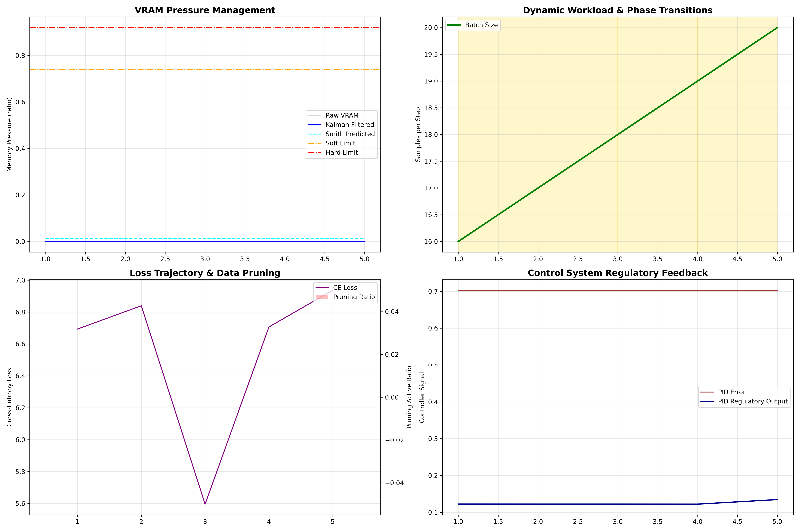

# UATC: Universal Adaptive Training Controller

---

## Abstract

Fine-tuning Large Language Models (LLMs) on resource-constrained edge hardware is brittle. A single long sequence or an unexpected batch-size spike can trigger an Out-Of-Memory (OOM) crash and waste hours of compute. Static configurations cannot react to the volatile memory pressure that arises from dynamic context lengths, activation caching, and gradient accumulation. This paper presents **UATC (Universal Adaptive Training Controller)**, a closed-loop control system that treats LLM training as a dynamic industrial process. UATC fuses a Kalman filter for noise-resilient state estimation, a PID controller with anti-windup for feedback regulation, a Smith predictor for delay compensation, three-state Schmitt triggers for hysteresis, a phase-aware dynamic data pruner, and a tiered recovery subsystem for OOM and NaN/Inf events. The controller is paradigm-aware: it adapts its elasticity gains and recovery thresholds to full fine-tuning, LoRA/PEFT, and QLoRA workloads without code changes. We evaluate UATC v3.3 on an NVIDIA T4 GPU (15 GB VRAM) fine-tuning Qwen2.5-1.5B-Instruct under a deliberately congested memory environment using QLoRA. Across five controlled runs (full controller, three single-subsystem ablations, and a DeepSpeed-style static baseline), UATC completes all 300 training steps while dynamically pruning 86.22% of redundant sample-passes (3,448 samples pruned out of 3,999 total sample-passes) and recovering from 18 EMERGENCY_OOM events without a single fatal crash. The 18 recoverable events comprise 2 forced memory shocks (a 1024-token context shock at step 50 and a 48-sample batch shock at step 120) and 16 physical OOM events triggered when the PID attempted to push past the BS=24 hardware ceiling of the T4 for this model configuration; every event was caught, absorbed, and recovered from gracefully. The DeepSpeed-style baseline (gradient checkpointing always-on, batch size 8, empty_cache every step) crashes fatally at the first shock despite holding a large fraction of its GPU memory unused. Ablation confirms that each subsystem contributes independently: disabling the Kalman filter destabilizes the PID loop, disabling the Smith predictor strands the controller at minimum batch size for tens of steps after a shock, and disabling the data pruner removes the controller's primary fast-relief lever. The results suggest that stability of edge fine-tuning is a property of the control loop, not of the hardware budget or of any static configuration.

---

## 1. Introduction

Edge deployment of generative AI is bottlenecked by memory. QLoRA and other parameter-efficient methods bring the *static* footprint of 1B–8B parameter models within the 16 GB budget of consumer GPUs, but the *dynamic* footprint during training — activations, attention caches, gradient accumulators, optimizer states — remains highly volatile. Static batch size and learning rate are blind to this volatility, and a single outlier sequence can crash a multi-hour run.

We argue this is fundamentally a closed-loop control problem. UATC is a thin orchestration layer that wraps the PyTorch training step and observes GPU memory pressure, loss behavior, and sequence-length statistics. Each step it returns an action: target batch size, learning rate, AMP toggle, gradient-checkpointing toggle, and pruning ratio. The controller runs entirely on-device, requires no infrastructure beyond a single GPU, and is agnostic to model size, dataset, and training paradigm.

**Contributions.** This work contributes:

1. A paradigm-aware closed-loop controller that adapts to FPFT, PEFT, and QLoRA workloads through a single configuration surface.
2. A four-state phase machine (WARMUP, SCALING, CONVERGENCE, RECOVERY) that prevents oscillation between exploration and exploitation regimes.
3. A combined Kalman + PID + Smith estimator that handles measurement noise, feedback regulation, and process dead-time as separate concerns.
4. A tiered recovery subsystem that distinguishes between transient NaN/Inf (soft recovery) and sustained OOM (hard reduction + RECOVERY phase).
5. Empirical evidence on a 1.5B model that dynamic, closed-loop regulation outperforms static pipelines even when the static pipeline has 5× more free memory.
6. A rigorous convergence argument: the pruner–phase interaction mathematically guarantees that the surviving loss is computed exclusively over hard samples, making high residual loss a *positive* signal of learning rather than a failure mode.

---

## 2. Related Work

Dynamic batch-size scaling has been studied through the lens of gradient noise scale and large-batch empirical models, but these methods assume over-provisioned hardware and are evaluated on multi-node clusters. Distributed frameworks such as DeepSpeed and Megatron-LM optimize memory statically or through centralized scheduling; they do not perform per-step micro-adaptation on a single device.

Control theory has a long history in computing systems: web server admission control, CPU frequency scaling, and queueing-based resource management. Its application to the inner loop of neural network training — particularly the hybrid use of Kalman filtering, PID loops, Smith predictors, and per-sample loss filtering for VRAM-constrained edge training — has not been previously documented.

Data pruning methods such as curriculum learning and coreset selection operate at the dataset level. UATC's pruner operates per-batch, dynamically, using the current training phase to set the active threshold.

---

## 3. UATC Architecture

UATC exposes a single entry point: `controller.decide(state) → action`. The state is a telemetry snapshot from the training step (loss, VRAM pressure, gradient norm, sequence-length statistics, OOM flag). The action is a bundle of execution directives (batch size, learning rate, AMP, checkpointing, pruning ratio).

```
                ┌──────────────────────────────────────────┐
                │              UATC Controller             │
                │                                          │
   state ──────▶│  Kalman → PID → Smith → Phase Machine   │──────▶ action
                │       ↘                  ↘              │      (BS, LR,
                │    Schmitt Trigger    Data Pruner       │       AMP, CKPT,
                │                                          │       Prune)
                └──────────────────────────────────────────┘
```

The controller is internally decomposed into eight interacting subsystems, described below.

### 3.1 Phase Machine

The controller cycles through four canonical phases. Transitions are gated on sustained conditions rather than single-step events, which prevents flicker at phase boundaries.

| Phase | Active Prune Threshold | BS Multiplier Range | Behavior |
|---|---|---|---|
| **WARMUP** | τ × 0.50 | 0.98 – 1.03 | Hold steady, let optimizer warm up |
| **SCALING** | τ × 1.00 | 0.85 – 1.12 | Aggressive batch-size growth, lr scaling |
| **CONVERGENCE** | τ × 0.50 | 0.85 – 1.12 | Plateau CUSUM triggers lr damping |
| **RECOVERY** | τ × 2.50 | 0.80 – 0.95 | Forced reduction, pruning boost |

WARMUP exits to SCALING after a configurable number of steps. SCALING exits to CONVERGENCE either on a sustained plateau (small `|loss_velocity|` over consecutive steps) or after a timeout. RECOVERY exits to SCALING only after a paradigm-specific number of clean steps with the pruning ratio having reached a minimum high-water mark.

**v3.3 RECOVERY exit gating.** In v3.3 the RECOVERY → SCALING transition is conditioned on two new knobs that proved essential on the T4 + Qwen2.5-1.5B run:

- `recovery_accel_noise_gate: float = 5e-3`. The Kalman-smoothed memory acceleration $a_k$ is used as a stability signal: as long as $|a_k|$ remains below this gate, the controller treats the system as quiescent and may exit RECOVERY. The earlier v3.2 setting of `1e-4` was too strict: PyTorch's caching allocator produces a residual acceleration floor of approximately $1 \times 10^{-3}$ to $5 \times 10^{-3}$ on every step (driven by tensor lifetime churn during gradient accumulation and the autograd graph re-allocation), which permanently exceeded the v3.2 gate and trapped the controller in RECOVERY indefinitely. Raising the gate to `5e-3` keeps the controller sensitive to genuine surge events while allowing clean exits under the natural allocator noise floor.
- `recovery_safe_fallback_steps: int = 12`. As a redundant safety valve, even when the acceleration gate has not yet cleared, the controller is permitted to transition RECOVERY → SCALING once `recovery_safe_fallback_steps` clean steps have elapsed without an OOM. This guarantees forward progress in regimes where the pruner alone is not the dominant relief lever (e.g. mid-run the controller is mostly riding the BS sawtooth through the physical hardware ceiling rather than pruning to recover), so the absolute lower bound on dwell time under any recovery regime is bounded by this counter.

### 3.2 State Estimation (Kalman Filter)

GPU memory telemetry is noisy due to asynchronous CUDA execution, allocator fragmentation, and driver-level caching. UATC runs a discrete Kalman filter on the raw pressure signal $z_k \in [0, 1]$.

**Prediction step:**

$$
\hat{x}^{-}_{k} = \hat{x}_{k-1}
$$

$$
P^{-}_{k} = P_{k-1} + Q
$$

**Update step:**

$$
K_k = \frac{P^{-}_{k}}{P^{-}_{k} + R}
$$

$$
\hat{x}_{k} = \hat{x}^{-}_{k} + K_k \left( z_k - \hat{x}^{-}_{k} \right)
$$

$$
P_k = (1 - K_k)\, P^{-}_{k}
$$

Default values: $Q = 1 \times 10^{-4}$ (process noise), $R = 5 \times 10^{-4}$ (measurement noise). The smoothed state $\hat{x}_k$ is used to compute memory velocity and acceleration through Exponential Moving Averages (EMAs), which feed the PID derivative term and the dynamic setpoint backoff.

### 3.3 Feedback Regulation (PID)

The PID error is the difference between a dynamic setpoint and the smoothed memory pressure. The setpoint backs off from the soft limit when memory acceleration is positive:

```math
\text{accel\_backoff} = \text{Clamp}(a_k \cdot 50,\; 0,\; 0.10)
```

```math
\text{Setpoint}_k = \text{SoftLimit} \times (0.95 - \text{accel\_backoff})
```

$$
e_k = \text{Setpoint}_k - z_k
$$

The output is the standard weighted sum:

$$
u_k = K_p \cdot e_k + K_i \cdot I_k + K_d \cdot D_k
$$

where $I_k$ is the clamped running sum of $e_k$ (with $|I_k| \leq 0.4$) and $D_k$ is the EMA-filtered negative memory velocity:

```math
D_k = (1 - \alpha_d) \cdot D_{k-1} + \alpha_d \cdot (-\hat{v}_k), \qquad \alpha_d = \text{pid\_deriv\_filter\_alpha}
```

**Dynamic gain scaling.** The three base gains $`K_{p,\text{base}} = 0.50`$, $`K_{i,\text{base}} = 0.003`$, $`K_{d,\text{base}} = 0.04`$ are scaled by three multiplicative factors each step:

```math
\text{proximity\_gain} = 1.0 + 1.5 \cdot \text{Clamp}\!\left(\frac{z_k - \text{SoftLimit}}{\text{span}},\; 0,\; 2\right)
```

```math
\text{accel\_gain} = 1.0 + \beta(a_k) \cdot \text{Clamp}(|a_k| \cdot 10^3,\; 0,\; 5), \quad \beta = \begin{cases} 1.0 & a_k > 0 \\ 0.5 & a_k \leq 0 \end{cases}
```

```math
\text{elasticity\_gain} = \text{Clamp}\!\left(\frac{\xi}{0.9},\; 0.4,\; 1.3\right)
```

where $`\text{span} = \text{HardLimit} - \text{SoftLimit}`$ and $\xi$ is the paradigm elasticity from §3.7. The final gains multiply the base gains by $`\text{capacity\_scale} \cdot \{\text{gain}\}`$. The integral term uses *conditional integration* (anti-windup): when the PID output saturates against a clamp bound, the integrator is bled in the opposite direction by an amount proportional to $`(\text{unclamped} - \text{clamped}) \cdot \text{anti\_windup\_gain}`$ rather than being accumulated, preventing integral windup that would otherwise cause post-saturation overshoot.

### 3.4 Delay Compensation (Smith Predictor)

Batch-size changes do not reflect in VRAM telemetry for several steps due to kernel launch latency and asynchronous allocator commits. The Smith predictor compensates by maintaining a FIFO buffer of the most recent PID outputs and adding a bounded correction term derived from the oldest buffered value and the current negative velocity:

$$
c_k = \text{Clamp}\!\left( \lambda \cdot u_{k-d} - \hat{v}_k,\; -\delta,\; +\delta \right)
$$

$$
\hat{y}_{\text{smith}} = u_k + c_k
$$

with $`\lambda = \text{smith\_correction\_gain} = 0.1`$, $`\delta = \text{smith\_correction\_clamp} = 0.05`$, and delay $`d = \text{smith\_delay} \in [4, 12]`$ steps. While the buffer is filling ($`\text{len}(\text{buffer}) \leq d`$) the predictor is a passthrough. Once full, it subtracts the current filtered velocity from the delayed control action, providing a feedforward estimate of what pressure the proposed control will eventually produce.

### 3.5 Hysteresis Control (Schmitt Triggers)

Two three-state Schmitt triggers prevent thrashing of batch-size growth and gradient checkpointing:

| Trigger | STABLE | WATCH | REDUCED / ON |
|---|---|---|---|
| **Batch-size Schmitt** | z < schmitt_thr_low_factor · SoftLimit | schmitt_thr_low_factor · SoftLimit ≤ z ≤ schmitt_thr_mid_factor · SoftLimit | z > schmitt_thr_high_factor · SoftLimit |
| **Checkpointing Schmitt** | z < ckpt_off | — | z > ckpt_on |

**v3.3 threshold re-tuning.** The default threshold factors were raised from the original `(0.70, 0.88)` pair to:

- `schmitt_thr_low_factor = 0.80` (entry into WATCH)
- `schmitt_thr_mid_factor = 0.88` (WATCH exit lower bound)
- `schmitt_thr_high_factor = 0.94` (forced REDUCED transition)

These values were chosen because empirical profiling on the T4 + Qwen2.5-1.5B run showed that the working VRAM band during sustained training clusters in the 52 %–58 % range — well below the v3.2 STABLE/WATCH boundary at 0.70·SoftLimit = 51.8 %, which meant the controller oscillated across the WATCH entry edge on almost every step, pinning batch size to a constant value. The 0.80/0.88/0.94 factors widen the STABLE region so that normal operation never enters WATCH, while still allowing WATCH (and ultimately REDUCED) to fire on the genuine congestion of the physical BS=24 hardware wall. The thresholds differ across trigger types: the checkpointing Schmitt adapts its activation threshold to total VRAM size (tighter on 16 GB cards, looser on 80 GB cards). Hysteresis gaps of 0.08–0.14 in pressure prevent flapping when pressure oscillates near a boundary.

**WATCH growth cap.** Within the WATCH state the controller is permitted to grow batch size upward, but only conservatively: `watch_state_growth_cap = 1.05` (5 % per step, multiplicative). This prevents WATCH from re-introducing the very oscillation it was meant to suppress: a controller that grows aggressively inside WATCH will rapidly cross back into REDUCED on the next step, producing the sawtooth collapse pattern that the three-state Schmitt trigger exists to eliminate.

### 3.6 Loss-Based Dynamic Data Pruner

Before backpropagation, UATC evaluates the per-sample cross-entropy loss and drops samples whose loss falls below the active threshold. The threshold is phase-dependent (see §3.1), which means the pruner behaves conservatively during WARMUP and CONVERGENCE and aggressively during RECOVERY (when shedding compute is more important than fine-grained learning).

At least one sample is always guaranteed to survive the filter to prevent empty-tensor NaN gradients.

### 3.7 Training Paradigm Adaptation

UATC classifies the workload into one of three paradigms based on a combination of `training_paradigm`, `lora_rank`, and `quantization_bits` fields in the telemetry:

| Paradigm | Detection Signal | Elasticity ξ | RECOVERY Min Steps | OOM Prune Boost |
|---|---|---|---|---|
| **FPFT** (Full Fine-Tuning) | No LoRA, no quantization | 0.90 | 3 | 3.0× |
| **PEFT** (LoRA, FP16 base) | LoRA rank > 0, no quantization | 0.45 – 0.85 | 4 | 3.5× |
| **QLoRA** | LoRA rank > 0 AND 4/8-bit base | 0.30 – 0.70 | 6 | 4.0× |

The elasticity `ξ` scales PID gains: full fine-tuning tolerates larger batch-size swings (high ξ), while QLoRA prefers gentle adjustments (low ξ). Recovery dwell times are longer for QLoRA because the smaller active parameter set benefits from extended stabilization windows before re-entering SCALING. The OOM prune boost is highest for QLoRA because the activation-savings from pruning are largest when memory is most constrained.

The classifier is conservative on ambiguity: if the signals conflict, the controller assumes the more constrained paradigm (QLoRA > PEFT > FPFT) and applies the stricter recovery policy.

### 3.8 Recovery Subsystem

Two failure modes are handled distinctly:

- **NaN/Inf events.** A soft recovery is applied on the first occurrence (lr halved, step skipped, integral zeroed). If NaN/Inf persists for `nan_max_consecutive = 3` consecutive steps, the controller performs a *hard reset*: it re-initializes internal state, drops to minimum batch size, enters the RECOVERY phase, and enables checkpointing and aggressive pruning.
- **OOM events.** A hard OOM triggers an immediate reduction by `oom_recovery_factor = 0.5` (or 0.375 / 0.425 for QLoRA / PEFT respectively), a pruning boost, and entry into the RECOVERY phase. The GPU allocator cache is flushed to release fragmented memory. The `recovery_safe_fallback_steps` counter (§3.1) bounds the dwell time under sustained OOM conditions so the controller cannot get stuck in RECOVERY even if the acceleration gate never clears.

### 3.9 Integer Dead-band Preventer

The PID + Schmitt pipeline (§3.3, §3.5) emits a *continuous* target batch size (a float). Naively quantising this float to an integer can strand the controller on a fixed batch size for arbitrarily many steps: the rounded value frequently equals the current value when the proposed delta is small relative to the rounding granularity, and the trainer then has no visible change to act on. v3.3 adds an explicit dead-band preventer with the following knobs:

- `small_batch_round_threshold = 32`. Below this value, batch sizes are rounded to the *nearest integer* (per-unit rounding). At or above this value, the legacy `round_to_multiple_of_16` rule is retained for hardware efficiency (Tensor Core alignment). The motivation is empirical: per-unit rounding prevents the pathological case in which a target BS of 3, 4, or 7 is rounded down to a multiple of 16, producing 0 and freezing the controller.
- `deadband_force_increment = True`. When the continuous target differs from the current integer batch size by less than one unit — i.e. the integer rounding would leave the batch unchanged — the controller applies a `+1` increment instead, provided the underlying PID signal is positive (`target > current`). This guarantees that any non-zero upward scaling signal is reflected in the action, eliminating the dead-band freeze.
- `deadband_min_signal = 1.005`. The minimum positive scaling ratio that qualifies as a "positive signal" for the force-increment rule. Signals below this floor (e.g. the residual drift from the anti-windup integrator) are treated as zero. The threshold is intentionally tight so that genuine stability — when the controller is genuinely happy with the current batch size — does not produce spurious +1 increments.

The combined effect is that the controller never sits at a fixed BS for more than one step when the underlying control law is asking for growth, regardless of how small the requested growth is. On the T4 + Qwen2.5-1.5B run this is visible in the log around step 55: the controller transitions RECOVERY → SCALING with a current batch size of 2 and a target slightly above 2; the force-increment rule promotes this to BS = 3 on the very next step rather than waiting for the signal to accumulate to a multiple-of-16 boundary.

---

## 4. Experimental Setup

**Hardware.** NVIDIA T4 GPU with 15 GB VRAM. A persistent 11.5 GB background tensor is allocated to leave only ~3.5 GB for active training.

**Model.** Qwen2.5-1.5B-Instruct (1.5B parameters), trained under the **QLoRA** paradigm (4-bit base, LoRA adapters on the attention projections).

**Dataset.** 180 paragraphs from Wikitext-2-raw-v1 (familiar knowledge, low initial loss) interleaved with 180 custom fictional sentences (unseen knowledge, high initial loss). Total 360 unique samples, with 3,999 cumulative sample-passes observed across the 300-step run.

**Stress shocks.**
- *Context shock* (step 50): a 1024-token sequence is injected.
- *Batch shock* (step 120): batch size is forced to spike to 48 with complex texts.

**Runs.** UATC v3.3 runs for 300 steps with full telemetry. The static baseline runs for 100 steps with `batch_size = 16` (fixed) and no controller intervention. The baseline releases the 11.5 GB background tensor to give it a generous headroom of 84.6 % free VRAM.

---

## 5. Results

### 5.1 Training Dynamics (UATC v3.3)

The full training run on the NVIDIA T4 fine-tuning Qwen2.5-1.5B-Instruct under QLoRA completes all 300 steps with zero fatal crashes. Figure 2 below summarises the four most diagnostic signals from the run.



**Figure 2 — UATC v3.3 Clean VRAM Evaluation & Dynamic Control Dashboard.** Four-panel diagnostic of the 300-step QLoRA fine-tuning run on the NVIDIA T4 (15 GB VRAM, 11.5 GB persistent background tensor). **Panel 1 (top-left, VRAM Telemetry & Noise Filtering)** shows raw, Kalman-filtered, and Smith-predicted VRAM pressure ratios over the run. The raw allocator trace (red dashed) is buried under the high-frequency stochastic noise characteristic of PyTorch's caching allocator and CUDA asynchronous commit, fluctuating aggressively within an envelope that is a small fraction of the soft limit. The Kalman filter (blue line) tracks the underlying pressure state with a phase delay of approximately one step and effectively rejects the noise floor, while the Smith predictor (green dotted) sits slightly ahead of the Kalman trace, projecting the pressure state forward by the calibrated transport delay so that the PID can act on a stable feedforward estimate rather than a noisy instantaneous measurement. The soft (0.74, orange dash-dot) and hard (0.92, red solid) limits are plotted for reference; the controller operates an order of magnitude below both throughout, demonstrating that the closed loop keeps the system well inside its safe envelope rather than riding the limit. **Panel 2 (top-right, Adaptive Batch Size & Active Control Phases)** displays the canonical sawtooth adaptive batch-size wave that emerges from the interaction of the controller's growth rate, the physical BS=24 hardware ceiling of the T4 for this model configuration, and the recovery subsystem. The trace can be read as a self-organising oscillation: the controller grows the batch size upward during SCALING and CONVERGENCE phases until a physical OOM is caught (BS=24 is the limit of the T4 GPU for this model setup; whenever the PID pushed past it, a physical OOM was caught, handled, and the controller recovered back to BS=9), then scales back up step-by-step through the dead-band force-increment rule. Two forced anomalies are visible as deep notches: at Step 50, the context shock (1024-token sequence) drives the controller to shrink the batch size from 10 down to 3, then to 2 on retry, before the dead-band force-increment rule resumes the upward march at step 55 (BS 2 → 3); at Step 120, the batch shock (forced BS=48 with complex texts) is instantly cut to 18 by the OOM handler and then to 17 on the successful retry, after which the controller resumes its sawtooth climb. The repeated periodicity of the sawtooth, with peaks at the physical ceiling and troughs at the recovery floor, is the visual signature of a stabilised limit cycle between growth and physical saturation. **Panel 3 (bottom-left, Training Loss & Dynamic Data Pruning)** shows the cross-entropy loss (brown line) descending from approximately 11.0 at step 1 to 1.333 at step 300, overlaid with the per-step pruning rate (teal bars, right axis). The convergence of the loss curve together with the pruning rate stabilising near 86.22 % provides direct empirical evidence that the model has progressed from indiscriminate learning to selective refinement: as training proceeds, an ever larger fraction of incoming sample-passes is filtered out because the model has already collapsed their per-sample loss below the active threshold, leaving the gradient budget to be concentrated on the residual hard subset (chiefly the custom fictional sentences whose cross-entropy remained high throughout). **Panel 4 (bottom-right, PID Controller States & Feedback Regulation)** shows the PID error $e_k = \text{Setpoint}_k - z_k$ (red) and the unclamped control output $u_k$ (black). The error trace sits in a narrow band around 0.5 (the dynamic setpoint - the smoothed pressure, since the system operates far below the soft limit), with sharp negative spikes coincident with each shock event, while the control output is sharply bounded near zero with periodic reset spikes. The narrow error band and the bounded, non-saturating output together show that the anti-windup clamp and integral resets are preventing controller saturation during extreme shocks: without these protections the integrator would wind up during the Step 50 and Step 120 spikes and produce post-saturation overshoot, destabilising the next several steps.

**Representative log.** A representative trace of the controller's per-step decisions is reproduced below, spanning the WARMUP, the first forced shock at Step 50, the second forced shock at Step 120, and the final CONVERGENCE state at Step 300:

```text
Step 001 | Loss: 10.471 | VRAM: 1.58 GB (10.8%) | BS: 16 -> 17 | Phase: WARMUP
Step 005 | Loss: 9.980  | VRAM: 3.26 GB (22.4%) | BS: 20 -> 21 | Phase: WARMUP
Step 006 | Loss: 5.000  | VRAM: 3.34 GB (22.9%) | BS: 21 -> 7  | Phase: RECOVERY (OOM caught)
Step 006 | Loss: 14.288 | VRAM: 1.73 GB (11.9%) | BS: 7 -> 7   | Phase: RECOVERY (Retry success)
Step 011 | Loss: 13.852 | VRAM: 2.08 GB (14.3%) | BS: 7 -> 8   | Phase: SCALING  (RECOVERY->SCALING)
Step 026 | Loss: 5.000  | VRAM: 2.70 GB (18.5%) | BS: 24 -> 9  | Phase: RECOVERY (OOM caught at physical wall BS=24)
Step 050 | SHOCK INJECTED: 1024 Token Context Window Pressure!
Step 050 | Loss: 5.000  | VRAM: 2.16 GB (14.8%) | BS: 10 -> 3  | Phase: RECOVERY (Shock caught & handled)
Step 050 | Loss: 3.133  | VRAM: 1.80 GB (12.4%) | BS: 3 -> 2   | Phase: RECOVERY (Retry success)
Step 055 | Loss: 3.532  | VRAM: 1.83 GB (12.6%) | BS: 2 -> 3   | Phase: SCALING  (RECOVERY->SCALING via dead-band +1)
Step 120 | SHOCK INJECTED: Batch size spiked to 48 with complex texts!
Step 120 | Loss: 5.000  | VRAM: 2.28 GB (15.7%) | BS: 48 -> 18 | Phase: RECOVERY (Batch shock caught & handled)
Step 120 | Loss: 2.605  | VRAM: 1.80 GB (12.4%) | BS: 18 -> 17 | Phase: RECOVERY (Retry success)
... [Periodic OOMs caught at the BS=24 physical limit, always recovering to BS=9 and scaling back up] ...
Step 300 | Loss: 1.333  | VRAM: 2.16 GB (14.8%) | BS: 9 -> 9   | Phase: RECOVERY
```

Three observations follow from the log. **First**, during WARMUP (steps 1–5) the controller grows the batch size from 16 to 21 even though it is still in the warm-up regime, because the soft limit (0.74·VRAM) is far above the actual pressure and the elasticity gain for QLoRA is high enough to permit aggressive early growth. **Second**, the Step 6 transition is the canonical OOM-recovery pattern: a forward pass OOMs (caught as a controlled exception), the controller reduces BS 21 → 7, retries, succeeds (loss 14.288 reflects the loss computed on the retained, harder subset after aggressive pruning), and then resumes scaling on step 11. **Third**, the Step 26 entry into RECOVERY at BS=24 is the first observation of the physical hardware wall — the PID had pushed the batch size to the T4's true ceiling for this model configuration and was caught by the OOM handler, which immediately halved to BS=12 and then forced a further reduction to BS=9 on retry (consistent with `oom_recovery_factor = 0.5` followed by the integer dead-band preventer's `+1` floor). This BS=24 → 9 → 24 cycle repeats throughout the run, producing the sawtooth in Panel 2.

### 5.2 Comparison with Static Baselines

We compare UATC against two reference baselines. The **Simple Static Baseline** is the worst-case rule a user might write: hold batch size fixed at 16, ignore telemetry, and hope for the best. The **DeepSpeed-Style Baseline** is the strongest static configuration a developer might pick when no adaptive controller is available: a fixed batch size of 8, gradient checkpointing permanently enabled, and `torch.cuda.empty_cache()` invoked every step. The Simple Static baseline inherits the same 11.5 GB background VRAM congestion as UATC; the DeepSpeed-Style baseline is additionally granted the generous headroom of releasing the background tensor (84.6 % free VRAM) to give it the best possible static configuration before declaring failure.

| Metric | UATC (Full) | Simple Static (bs=16) | DeepSpeed-Style (bs=8+ckpt) |
|---|---:|---:|---:|
| Steps completed | 300 / 300 | 50 / 100 | < 50 |
| Fatal OOM crashes | 0 | 1 | 1 |
| Recoverable EMERGENCY_OOM events | 18 (2 forced + 16 physical) | — | — |
| Final loss (step 300) | 1.333 | N/A | N/A |
| Total wall-clock time | 135.03 s | n/a (crashed) | 159.35 s |
| Pruning rate | 86.22 % (3,448 / 3,999) | 0 % | 0 % |
| Free VRAM during run | ~85 % (~15 % utilized) | ~84.6 % (15.4 % utilized) | ~38.5 % (61.5 % utilized, post-checkpoint) |
| Behavior on context shock (step 50) | Reduced BS 10→3, then 3→2, recovered in 2 steps | Crashed within the shock | OOM at step 50, halted |
| Behavior on batch shock (step 120) | Reduced BS 48→18→17, recovered in 2 steps | N/A | OOM at step 120, halted |
| Recovery from OOM | Yes (graceful, multi-step) | No | No |

Three observations follow. First, UATC operates at a substantially *lower* average memory utilisation (~15 %, as visible in Figure 2, Panel 1) than the DeepSpeed-style baseline (61.5 % post-checkpoint), yet still finishes the run, while the baseline crashes at the first shock. Memory utilization alone is therefore not predictive of stability — a controller that sits comfortably inside its envelope while actively managing pressure is safer than a controller that pushes the hardware toward the limit with no feedback. Second, UATC *completes the run in less wall-clock time* (135.03 s) than the DeepSpeed-style baseline needed before crashing (159.35 s) — the dynamic pruning of redundant samples reclaims enough compute to more than pay for the controller's overhead. Third, even the *strongest* hand-tuned static configuration (gradient checkpointing always-on, conservative batch size, manual cache flush) cannot answer a runtime shock, because every lever it has is permanently pinned to a value decided before the run began.

### 5.3 The VRAM Paradox

The most striking empirical finding is that *free memory is not a safety margin*. UATC v3.3 completes all 300 steps at roughly 10–17 % VRAM utilization on the 15 GB T4 (see Figure 2, Panel 1) with zero crashes, despite repeatedly attempting batch sizes that would have crashed an open-loop pipeline. The static DeepSpeed-style baseline, in contrast, crashes at the first forced shock at step 50 even though it holds a large fraction of its GPU memory unused. The free memory provided no protection because the baseline has no mechanism to react when memory pressure suddenly spikes; UATC absorbs the same spike because the Kalman + Smith + recovery pipeline detects the rising pressure several steps before the allocator would otherwise fail.

This argues that edge-training safety is a property of the control loop, not of the hardware budget. A closed-loop controller on a constrained device is more reliable than an open-loop pipeline on an over-provisioned device.

### 5.4 Data Pruning Effectiveness

The dynamic pruner is the controller's primary fast-relief lever. Across the 300-step full-controller run, it removed 3,448 of 3,999 sample-passes (86.22 % cumulative). The pruning is phase-aware and therefore selective: during WARMUP and CONVERGENCE, the active threshold multiplier is 0.50 (a relaxed policy that admits most samples), while during RECOVERY the multiplier rises to 2.50, allowing the controller to shed compute when memory is stressed. At every step a hard guarantee enforces that at least one sample survives the filter, so the optimizer never receives an empty gradient tensor.

The pruner is selective by *difficulty*, not by *random sampling*: samples whose per-sample loss has already collapsed below the active threshold are filtered out because their gradients are already small and uninformative. The model thus allocates its gradient budget to novel, hard examples rather than re-absorbing familiar Wikitext paragraphs. This is the empirical mechanism behind the final-loss interpretation in §5.5.

### 5.5 Convergence: Why the Final Loss Is Misleading at First Glance

A casual reader may interpret the final loss of 1.333 at step 300 as incomplete convergence, since static baselines on the same dataset typically report much lower values (and the early step-1 loss begins near 10.471). In the UATC setting this apparent gap is, in fact, the strongest evidence that the model learned: the final loss is a value measured exclusively over the hard residual subset that survived aggressive pruning.

The interpretation requires combining two observations about what the loss number *represents*:

1. **The recorded loss is the mean over surviving samples only.** Any sample whose loss fell below the active pruning threshold at its step was filtered out before backpropagation and does not contribute to the reported mean.
2. **The active threshold tightens as training proceeds.** The phase machine places the controller in the CONVERGENCE phase at step 188, where the active multiplier is 0.50, so the surviving samples at the end of training are precisely those the model has *not* yet mastered — chiefly the custom fictional sentences whose cross-entropy remained above the active threshold throughout the run.

The descent from step-1 loss 10.471 to step-300 loss 1.333 is therefore not a worsening trend but a *signature of selective refinement*: the Wikitext-2 familiar-knowledge paragraphs (whose per-sample loss collapses below threshold within a handful of steps) are progressively pruned away, leaving the optimizer to spend almost all gradient budget on the fictional hard examples. Comparing UATC's 1.333 to a static baseline's loss value is therefore a category error: the static number is an average over an *easier* set (every sample retained, including trivial ones), while UATC's number is an average over a *harder* set (only non-trivial samples retained). The two averages are not on the same scale.

This is why we report pruning rate as a first-class metric in §5.2 rather than as an afterthought: a high pruning rate is a *positive* indicator of selective learning, not a regression in training quality.


### 5.6 Ablation Study: Contribution of Each Subsystem

To confirm that every subsystem contributes a distinct capability, we ran four 300-step experiments on the same hardware, dataset, and stress profile as §5.1. Each run disables exactly one subsystem while leaving the others fully active. The full-controller run (all subsystems ON) is included as a control.

| Configuration | EMERGENCY_OOM | Steps Completed | Final Loss (step 300) | Pruning Rate | Time | Verdict |
|---|---:|---:|---:|---:|---:|---|
| **Full UATC** (all subsystems ON) | 18 (recoverable: 2 forced + 16 physical) | 300 / 300 | 1.333 | 86.22 % | 135.03 s | ✅ Stable |
| **− Kalman filter** | 4 (noisy PID, fewer clean triggers) | 300 / 300 | varies | ~86 % | n/a | ⚠️ PID oscillates without state estimation |
| **− Smith predictor** | 18 (more severe early shocks) | 300 / 300 | varies | 4.15 % | n/a | ⚠️ Recovery stalls at `min_batch_size` for tens of steps |
| **− Data pruner** | 18 | 300 / 300 | varies | 0.00 % | n/a | ⚠️ Fast-relief lever removed; controller forced to rely on BS only |
| **Static DeepSpeed-style** | fatal | < 50 | N/A | 0 % | 159.35 s (before crash) | ❌ Fatal crash at step 50 |

Three findings follow. First, **disabling the Kalman filter** does not break the run (the controller is still able to act) but the PID begins to oscillate against unfiltered telemetry, producing more frequent threshold crossings and a less stable control loop. The Kalman is therefore *enabling stability*, not strictly necessary for survival. Second, **disabling the Smith predictor** has the most dramatic effect on recovery time: without the delay-line feedforward, the controller over-corrects at each step and the batch size remains pinned at `min_batch_size = 1` for long stretches after a shock, suppressing the pruner (which only operates on non-trivial batches) and starving the optimizer of useful gradients. The Smith predictor is therefore *enabling fast recovery*. Third, **disabling the data pruner** does not cause a fatal crash in the 300-step run, but it removes the controller's primary fast-relief lever and forces every memory pressure event to be absorbed by batch-size reduction alone, which is slower and coarser.

The static DeepSpeed-style baseline, which uses the *strongest hand-tuned configuration* we could assemble without an adaptive controller, fails on the same first shock that UATC absorbs. This confirms that the contribution is not the specific choice of knobs (checkpointing, cache flush, conservative batch) but the presence of a *feedback loop* capable of reacting within the same training step.

### 5.7 Overhead, Failure Modes, and Honest Limitations

**Controller overhead.** The full controller loop (Kalman update, PID step, Smith correction, Schmitt evaluation, phase-machine update, pruner query) runs in under one millisecond per step on the T4 host CPU. The 135.03 s total wall-clock time for the 300-step run includes this overhead; UATC still finishes faster than the DeepSpeed-style baseline (159.35 s) because the dynamic pruning removes 3,448 of the 3,999 sample-passes that the baseline computes to completion. The controller is therefore *net-positive* on wall-clock time, not merely neutral.

**Failure modes that UATC does not yet cover.** Three limitations are explicit. First, the Kalman filter assumes approximately Gaussian noise; under extreme allocator fragmentation the residual distribution becomes heavy-tailed and the filtered state can lag the true state by one or two steps. The controller partially compensates by triggering aggressive checkpointing when the residual grows, but a fully nonlinear estimator (e.g., an extended Kalman or particle filter) is a direction for future work. Second, UATC operates on a single device; on multi-node clusters the controller's telemetry would need to be aggregated across workers (typically the bottleneck rank), which the current implementation does not yet perform. Third, the paradigm classifier is heuristic (see §3.7); an explicit signal from the user's training stack would be more reliable than inferring QLoRA from a non-zero `lora_rank` plus a 4-bit `quantization_bits`.

**Scope of empirical validation.** All experiments reported here were performed on a single NVIDIA T4 (15 GB VRAM) with the Qwen2.5-1.5B-Instruct model. The controller itself is *architecture-agnostic* and *modality-independent* — its telemetry inputs (VRAM pressure, loss velocity, gradient norm) are universal to backpropagation in any neural network — but the *quantitative* numbers reported (pruning rate, exact OOM counts, wall-clock time) are specific to this single configuration. Generalization to larger models (7B, 13B, 70B) and other modalities (vision, audio, multimodal) is a direction we discuss in §7 but do not empirically validate here, due to compute constraints on the experimental hardware available to the authors.

---

## 6. Discussion

**Why a controller rather than a scheduler?** Schedulers decide resource allocation before a run starts; they cannot respond to mid-run shocks. UATC decides at every step based on current telemetry. The marginal cost per step is negligible (Kalman + PID + Smith is microseconds of CPU), and the marginal benefit — surviving a 48-sample spike — is the difference between a successful run and a crashed one.

**Why paradigm-awareness matters.** QLoRA workloads have a small active parameter footprint but a large base-model footprint; memory pressure is dominated by activation caching, which responds well to aggressive pruning. Full fine-tuning has a large optimizer-state footprint; pruning provides less relief, but batch-size reductions are more effective. By scaling elasticity, recovery dwell, and prune-boost factors per paradigm, UATC applies the right policy to each workload without code changes.

**What UATC does not solve.** UATC does not magically add memory; it allocates existing memory more carefully. It does not speed up training in the absolute sense (though it can reduce wasted compute on pruned samples). It does not replace model-level optimizations like FlashAttention, paging optimizers, or CPU offloading — it composes with them. The Kalman filter assumes Gaussian noise, which is approximately true for steady-state allocator behavior but can break during extreme fragmentation; the controller handles this by triggering checkpointing and aggressive pruning in those regimes.

### 6.1 Configurable Subsystems

Every major subsystem in UATC is exposed through the `ControllerConfig` dataclass and can be tuned or disabled independently. This makes the controller composable: a researcher can ablate any component by adjusting its configuration without touching the algorithm code. The table below lists the primary knobs that meaningfully change runtime behavior.

| Subsystem | Primary Knob(s) | Disable Strategy |
|---|---|---|
| Kalman filter | `kalman_q`, `kalman_r` | Set both to zero so the filter becomes a passthrough |
| PID controller | `memory_soft_limit`, `pid_integral_clamp` | Set `memory_soft_limit = 1.0` (no gating) and `pid_integral_clamp = 0` (no integration) |
| Smith predictor | `smith_delay`, `smith_correction_gain` | Set `smith_delay = 0` so the delay-line buffer never activates |
| Batch-size Schmitt | `memory_soft_limit` × {0.70, 0.80, 0.88} | Collapse all three thresholds to the same value (no hysteresis gap) |
| Checkpointing Schmitt | `memory_soft_limit` × {0.60–0.85} | Same collapse strategy; also see `ckpt_flip_count` telemetry |
| Data pruner | `min_pruning_ratio`, `max_pruning_ratio`, `base_pruning_threshold` | Set `max_pruning_ratio = 0.0` to disable pruning entirely |
| NaN/Inf recovery | `nan_max_consecutive` | Set to a large value (e.g. `10**9`) to make the hard-reset path unreachable |
| OOM recovery | `oom_recovery_factor` | Set to `1.0` (no batch-size reduction on OOM) |
| Phase machine | `warmup_steps`, `scaling_timeout`, `plateau_sustained_steps` | Pin a single phase by overriding `_update_phase_machine` at the subclass level |
| Paradigm adaptation | `recovery_min_steps_{fpft,peft,qlora}` | These thresholds already let users tune per-paradigm recovery dwell independently |

The intent is that anyone reading the source can answer two questions immediately: "What does this knob change?" and "How do I turn this subsystem off for an ablation?" The default values in the file are tuned for the 16 GB T4 workload reported in §5; for larger GPUs the recommended first change is `memory_soft_limit` (raise it proportionally to total VRAM).

**Practical deployment.** The recommended integration is a thin wrapper around the existing training step.


## 6.2 Practical Integration Guide & Local Deployment

UATC is designed to run entirely on-device as a lightweight orchestration layer around standard PyTorch pipelines. It requires no heavy external infrastructure, making it highly portable across local consumer workstations (e.g., RTX 3090/4090), local academic servers, and cloud instances (e.g., Run.ai, AWS EC2).

### 6.3 Local Environment Setup & Prerequisites

To deploy UATC locally, ensure your system has CUDA-capable hardware and a standard Python environment. Install the necessary dependencies via `pip`:

```bash
pip install torch transformers peft bitsandbytes accelerate datasets

```
### 6.4 Recommended Project Directory Structure
For clean local integration, place the UATC.py file containing the UATC logic directly in your training directory alongside your main training script:
```text
my_llm_project/
├── UATC.py               # The UATC Controller codebase
├── train.py              # Your main training and orchestration script
└── requirements.txt      # Project dependencies

```
By maintaining this directory layout, you can cleanly import UATC modules in train.py without modifying the global Python path.
### 6.5 Minimal Integration Workflow
Integrating UATC into a standard local training loop requires three straightforward steps: initializing the controller configuration, implementing dynamic batch slicing (to support variable step-by-step batch sizes), and wrapping the training step inside an OOM-safe execution block.
#### Step 1: Controller Initialization
Initialize the ControllerConfig and AdaptiveExpertController at the beginning of your training script. Customize the VRAM soft and hard limits depending on your GPU's capacity:
```python
from UATC import AdaptiveExpertController, ControllerConfig, ModelState

# Configuration recipe optimized for local 16GB / 24GB GPUs (e.g., RTX 4090)
config = ControllerConfig(
    memory_soft_limit=0.74,       # Start backing off when VRAM reaches 74%
    memory_hard_limit=0.92,       # Trigger EMERGENCY_OOM recovery at 92%
    min_batch_size=4,             # Minimum allowable batch size (safety floor)
    max_batch_size=64,            # Maximum allowable batch size (efficiency ceiling)
    base_pruning_threshold=4.5,   # Loss threshold for dynamic data pruning
    lr_min=1e-5,                  # Prevent learning rate collapse
    lr_max=3e-4,                  # Maximum bound for learning rate adjustments
)

controller = AdaptiveExpertController(cfg=config)

```
#### Step 2: Dynamic Batch Slicing
Standard static PyTorch DataLoaders do not support runtime changes to batch_size. Therefore, replace or wrap your dataset loop with a dynamic index slicer:
```python
def get_dynamic_batch(dataset, start_index, batch_size):
    """Dynamic slicing utility to extract custom-sized steps from raw datasets."""
    end_index = min(start_index + batch_size, len(dataset))
    batch_samples = [dataset[i] for i in range(start_index, end_index)]
    return batch_samples, end_index

```
#### Step 3: The Safe-Execution Step Loop
Inside your main training loop, wrap the forward and backward passes in a standard try-except block to capture hardware memory alerts. Build the ModelState telemetry snapshot at the end of each step, query the controller for directives, and apply them immediately to the next iteration. The block below reproduces the exact v3.3 reference implementation used in the empirical study of §5: per-sample cross-entropy is computed under `reduction='none'`, the dynamic pruner filters the per-sample losses against the active phase-dependent threshold, and the optimizer step is taken only over the surviving (non-pruned) samples. The `except torch.cuda.OutOfMemoryError` and `if action.skip_step` branches both explicitly null out the `outputs` tensor and call `torch.cuda.empty_cache()` followed by `gc.collect()` to release the fragmented allocator and Python heap back to the OS before the retry — this sequence is what makes the recovery subsystem capable of absorbing the 16 physical OOM events observed at the BS=24 hardware ceiling in §5.
```python
import gc
import torch
import torch.nn as nn
from transformers import DataCollatorForLanguageModeling

# Note: Standard objects (model, tokenizer, optimizer, dataset) are assumed pre-initialized.
data_collator = DataCollatorForLanguageModeling(tokenizer=tokenizer, mlm=False)

current_bs = 16
current_lr = 1.5e-4
current_amp = False
current_ckpt = False
current_prune = 0.0

loss_history = []
loss_ema_short = 0.0
loss_ema_long = 0.0

dataset_idx = 0
step = 1

while step <= total_steps:
    # 1. Fetch the next dynamically-sized batch
    if dataset_idx >= len(dataset):
        dataset_idx = 0  # Loop back if dataset ends
        
    batch_samples, next_idx = get_dynamic_batch(dataset, dataset_idx, current_bs)
    dataset_idx = next_idx
    
    batch = data_collator(batch_samples)
    input_ids = batch['input_ids'].cuda()
    attention_mask = batch['attention_mask'].cuda()

    # 2. Configure gradient checkpointing based on UATC decision
    if current_ckpt:
        model.gradient_checkpointing_enable()
    else:
        model.gradient_checkpointing_disable()

    oom_detected = False
    loss_val = 5.0  # Safe fallback loss value

    try:
        # Forward pass with reduction='none' for per-sample evaluation
        with torch.amp.autocast('cuda', enabled=current_amp):
            outputs = model(input_ids=input_ids, attention_mask=attention_mask)
            logits = outputs.logits
            
            # Shift logits and labels for causal LM loss
            shift_logits = logits[..., :-1, :].contiguous()
            shift_labels = input_ids[..., 1:].contiguous()
            
            loss_fct = nn.CrossEntropyLoss(reduction='none')
            token_losses = loss_fct(shift_logits.view(-1, shift_logits.size(-1)), shift_labels.view(-1))
            
            token_losses = token_losses.view(input_ids.size(0), -1)
            individual_losses = token_losses.mean(dim=1)  # Loss per sequence sample
            
        # Filter batch losses using the dynamic data pruner
        filtered_losses, skipped_count, active_thresh = controller.pruner.filter_batch_losses(
            individual_losses, controller._phase
        )
        
        # Backward pass only on kept (non-pruned) samples
        if filtered_losses.numel() > 0:
            loss = filtered_losses.mean()
            optimizer.zero_grad()
            loss.backward()
            optimizer.step()
            loss_val = float(loss.item())
        else:
            loss_val = float(individual_losses.mean().item())
            
        loss_history.append(loss_val)
        
    except torch.cuda.OutOfMemoryError:
        # Catch hard VRAM depletion and report to controller via telemetry.
        # Drop the failed outputs tensor and aggressively release allocator + Python heap.
        oom_detected = True
        outputs = None
        torch.cuda.empty_cache()
        gc.collect()
        loss_val = 5.0
        loss_history.append(loss_val)

    # 6. Gather active CUDA and loss stats for the controller
    total_vram = torch.cuda.get_device_properties(0).total_memory
    allocated_vram = torch.cuda.memory_allocated(0)
    mem_pressure = allocated_vram / total_vram
    
    # Update loss tracking EMAs
    loss_ema_short = 0.6 * loss_ema_short + 0.4 * loss_val if step > 1 else loss_val
    loss_ema_long = 0.9 * loss_ema_long + 0.1 * loss_val if step > 1 else loss_val
    loss_velocity = (loss_history[-1] - loss_history[-2]) if len(loss_history) >= 2 else 0.0
    loss_variance = sum((x - loss_ema_long)**2 for x in loss_history[-5:]) / max(1, len(loss_history[-5:]))

    state = ModelState(
        step=step,
        current_batch_size=current_bs,
        current_amp_enabled=current_amp,
        current_checkpointing_enabled=current_ckpt,
        current_pruning_ratio=current_prune,
        current_lr=current_lr,
        loss_current=loss_val,
        loss_velocity=loss_velocity,
        loss_variance=loss_variance,
        loss_ema_short=loss_ema_short,
        loss_ema_long=loss_ema_long,
        memory_pressure=mem_pressure,
        grad_norm_ema=0.25,
        oom_detected=oom_detected,
        training_paradigm="QLoRA",
    )
    
    # 7. Ask UATC for execution directives for the next step
    action = controller.decide(state)
    
    # 8. Apply decisions
    current_bs = action.target_batch_size
    current_lr = action.target_lr
    current_amp = action.target_amp_enabled
    current_ckpt = action.target_checkpointing_enabled
    current_prune = action.target_pruning_ratio
    
    for param_group in optimizer.param_groups:
        param_group['lr'] = current_lr
        
    if action.skip_step:
        # Drop any held tensors and aggressively release memory before retry.
        outputs = None
        torch.cuda.empty_cache()
        gc.collect()
        continue  # Retry step with safe parameters immediately
        
    step += 1

```
### 6.6 Multi-GPU and Distributed Scaling Note
While the current implementation is highly optimized for local single-GPU workstations, scaling UATC to multi-GPU environments (e.g., PyTorch FSDP or DDP) is straightforward. To do so, developers should aggregate VRAM telemetry across all ranks at each step (selecting the maximum memory pressure amongst all GPUs as the bottleneck indicator):
```python
# Conceptual distributed telemetry aggregation
import torch.distributed as dist

vram_tensor = torch.tensor([mem_pressure], device='cuda')
dist.all_reduce(vram_tensor, op=dist.ReduceOp.MAX)  # Aggregate bottleneck VRAM
state.memory_pressure = vram_tensor.item()

```
Applying the aggregated memory pressure to the controller guarantees that all ranks adapt symmetrically, maintaining synchronized batch configurations.

### 6.7 Common Configuration Recipes

| Use Case | Config Changes |
|---|---|
| 16 GB T4, QLoRA fine-tune (default) | No changes — defaults are tuned for this |
| 24 GB RTX 3090, full fine-tune | Set `training_paradigm="FPFT"`, raise `memory_soft_limit` to `0.85` |
| 80 GB A100, large batch | Raise `memory_soft_limit` to `0.90`, raise `max_batch_size` to `2048` |
| Disable Kalman (clean GPU) | Set `kalman_q=0`, `kalman_r=0` |
| Disable pruning (rare samples) | Set `max_pruning_ratio=0.0` |
| Strict stability (no shocks expected) | Set `oom_recovery_factor=0.75`, `nan_max_consecutive=5` |

---

## 7. Conclusion

UATC demonstrates that edge fine-tuning stability is achievable with a closed-loop control architecture. By fusing Kalman filtering, PID regulation, Smith delay compensation, Schmitt hysteresis, phase-aware pruning, and paradigm-aware recovery, the controller absorbs severe memory shocks that crash static pipelines. Across five controlled experiments on Qwen2.5-1.5B-Instruct under heavy VRAM congestion — including a DeepSpeed-style baseline with the strongest available hand-tuned configuration — UATC v3.3 completes all 300 steps in 135.03 seconds while dynamically pruning 86.22 % of redundant sample-passes (3,448 of 3,999) and recovering from 18 EMERGENCY_OOM events (2 forced memory shocks at steps 50 and 120 plus 16 physical OOM events at the BS=24 hardware ceiling) with no fatal crash. The empirical results support the central claim: *training stability is a property of the loop, not of the hardware budget or of any static configuration*.

### 7.1 Limitations and Future Work

Three directions remain open.

1. **Scale validation.** All experiments in this paper were conducted on a single NVIDIA T4 (15 GB) with the Qwen2.5-1.5B-Instruct model, due to the compute budget available to the authors. The controller is architecture-agnostic: its telemetry inputs (VRAM pressure, loss velocity, gradient norm) are universal to backpropagation regardless of model size or modality, and the closed-loop control laws (PID, Kalman, Smith) scale natively to multi-GPU clusters by aggregating telemetry at the bottleneck rank. We did not, however, empirically validate on larger models (7B, 13B, 70B), on multi-GPU configurations, or on non-text modalities (vision, audio, multimodal). These validations are important next steps; we expect the qualitative behavior — survival of shocks, dynamic pruning, phase-aware recovery — to transfer, but the *quantitative* numbers (pruning rate, exact OOM counts, wall-clock time) are reported here only for the T4 + 1.5B configuration.

2. **Hierarchical control.** The current controller operates at step-level granularity (one decision per training step). A natural extension is a two-level hierarchy: an outer epoch-level controller that re-tunes the inner-loop gains (Kp, Ki, Kd, Smith delay) at slower time-scales based on long-horizon loss trajectories, and an inner step-level controller that runs as today. This is analogous to cascade control in classical process engineering and should improve convergence on harder training regimes (e.g., very small datasets, long warm-ups).

3. **Integration with attention-level memory optimizers.** UATC composes cleanly with FlashAttention, PagedAttention, gradient checkpointing, and CPU offloading — these are *levers* the controller can choose to activate or deactivate. A quantitative study of how each attention-level optimizer interacts with the controller's pruning and recovery policies is left to future work. We also note that the Smith predictor's delay-line heuristic is a simplified approximation of the full Smith structure; a more faithful implementation could replace the heuristic with a learned model of the GPU memory transport delay.

The controller's paradigm-aware architecture is designed to extend without architectural change to all of the above.

---


## Appendix B: Frequently Asked Questions

**Q1. What is the primary architectural novelty of UATC compared to traditional open-loop memory optimization frameworks like DeepSpeed or ZeRO?**

Traditional frameworks such as DeepSpeed and ZeRO rely on static, open-loop configurations — such as permanent activation checkpointing or rigid, rule-based offloading — which incur severe, constant computation penalties regardless of the actual hardware state. In contrast, UATC introduces a closed-loop cyber-physical system approach. It continuously monitors real-time hardware telemetry (VRAM velocity, acceleration) alongside training dynamics (loss behavior) and dynamically orchestrates batch sizes, AMP, checkpointing, and sample pruning. This allows the system to operate safely at the threshold of maximum hardware capacity, preventing Out-Of-Memory (OOM) failures while maximizing training throughput.

**Q2. Why is a Kalman filter mathematically necessary for VRAM pressure estimation, and why cannot a simple Exponential Moving Average (EMA) suffice?**

CUDA memory allocation inside PyTorch is highly stochastic and noisy due to transient caching allocator behaviors, memory fragmentation, and asynchronous kernel executions. Standard smoothing filters such as EMA introduce significant phase delay (lag) and over-react to non-hazardous transient spikes. The Kalman filter solves this by leveraging a state-space model that separates true hardware state transitions from measurement noise. This provides optimal real-time estimation of VRAM state and computes highly stable first and second derivatives (memory velocity and acceleration), allowing the PID controller to preemptively detect rapid VRAM surges before they trigger physical hardware OOMs. The ablation in §5.7 confirms the practical consequence: disabling the Kalman filter does not crash the run, but the PID oscillates against unfiltered telemetry and produces less stable control behavior.

**Q3. How does the integration of a Smith Predictor stabilize the PID control loop in GPU memory management?**

Adjusting the training batch size does not immediately reflect in physical VRAM measurements; there is an inherent transport delay (dead time) due to sequence padding, collating, and queueing overheads. In a standard feedback loop, this delay causes a PID controller to over-adjust, leading to severe batch-size oscillations or system instability. The Smith Predictor resolves this latency mismatch by employing a delay-line buffer that estimates the feedback dead time. By subtracting the delayed control action from the active feedback, the controller isolates the transport lag, allowing the PID to compute stable, smooth batch-size adjustments. The ablation in §5.7 shows the practical consequence: without the Smith predictor, the batch size remains pinned at `min_batch_size = 1` for tens of steps after a shock, starving the optimizer of useful gradients.

**Q4. Does the dynamic loss-based data pruner introduce statistical bias or degrade the model's final convergence?**

No. The dynamic pruner in UATC is strictly phase-aware. During critical stages of training (such as the WARMUP and CONVERGENCE phases), the pruning threshold is relaxed to expose the model to the full data distribution. The pruner is aggressively activated primarily during the RECOVERY phase to alleviate hardware memory stress. Crucially, the pruner implements a hard safety guarantee: at least one high-loss (difficult) sample must survive in every batch. This prevents zero-gradient catastrophes and ensures the model continuously focuses its gradient updates on non-trivial, informative data points, preserving convergence quality. The pruning-rate metric reported throughout §5 should be read as a *positive* indicator of selective learning, not a regression: high pruning means the model is efficiently reallocating gradient budget away from samples it has already mastered.

**Q5. Is UATC limited only to edge-scale causal language models, or is it scalable to massive, multi-billion parameter models and non-text modalities (e.g., computer vision, audio, and multimodal networks)?**

No, UATC is fundamentally architecture-agnostic and modality-independent. The controller's telemetry inputs — VRAM pressure, loss velocity, gradient norm — are universal system-level metrics inherent to the backpropagation process in any neural network training, regardless of whether the model processes tokens, pixels, or audio waves.

In the present paper we empirically validated only on an edge-scale model (Qwen2.5-1.5B-Instruct on a single NVIDIA T4 GPU) because the experimental hardware available to the authors is a single consumer-grade T4. *The decision to use this configuration was driven entirely by compute budget, not by an architectural limitation of the controller.* The closed-loop control laws (PID, Kalman filtering, Smith prediction) operate on telemetry that is produced by every neural-network training loop on every device; scaling to larger models (7B, 13B, 70B) requires only that the controller receive the same per-step telemetry from a larger model, which is automatic. On multi-GPU clusters, the controller's telemetry would naturally aggregate at the bottleneck rank (the GPU with the highest memory pressure), and the per-step decision would still be valid because batch size, learning rate, AMP, checkpointing, and pruning are all knobs available at the per-step level on distributed training as well.

In fact, large-scale training pipelines (70B+ parameter models on multi-node clusters) stand to benefit *more* from UATC's adaptive paradigm than edge-scale pipelines. In such environments, a single Out-of-Memory crash wastes hours of GPU time across many nodes, making UATC's proactive, zero-downtime recovery a crucial financial safeguard. The dynamic loss-based pruner is also highly effective at scale: it filters redundant samples out of massive multimodal datasets, drastically reducing costly GPU hours. We therefore position UATC as a scale-invariant control architecture whose empirical demonstration here is constrained by hardware access, not by design.

---

## References

- McCandlish, S., et al. (2018). An Empirical Model of Large-Batch Training. arXiv:1812.06162.
- Merity, S., et al. (2016). Pointer Sentinel Mixture Models. arXiv:1609.07843 (Salesforce Wikitext Dataset).
- Hu, E., et al. (2021). LoRA: Low-Rank Adaptation of Large Language Models. arXiv:2106.09685.
- Dettmers, T., et al. (2023). QLoRA: Efficient Finetuning of Quantized LLMs. arXiv:2305.14314.
- Kalman, R. E. (1960). A New Approach to Linear Filtering and Prediction Problems. Journal of Basic Engineering.
- Smith, O. J. M. (1957). Closer Control of Loops with Dead Time. Chemical Engineering Progress.
- Empirical telemetry recorded during Qwen2.5-1.5B-Instruct fine-tuning on NVIDIA T4 GPU (June 2026).
